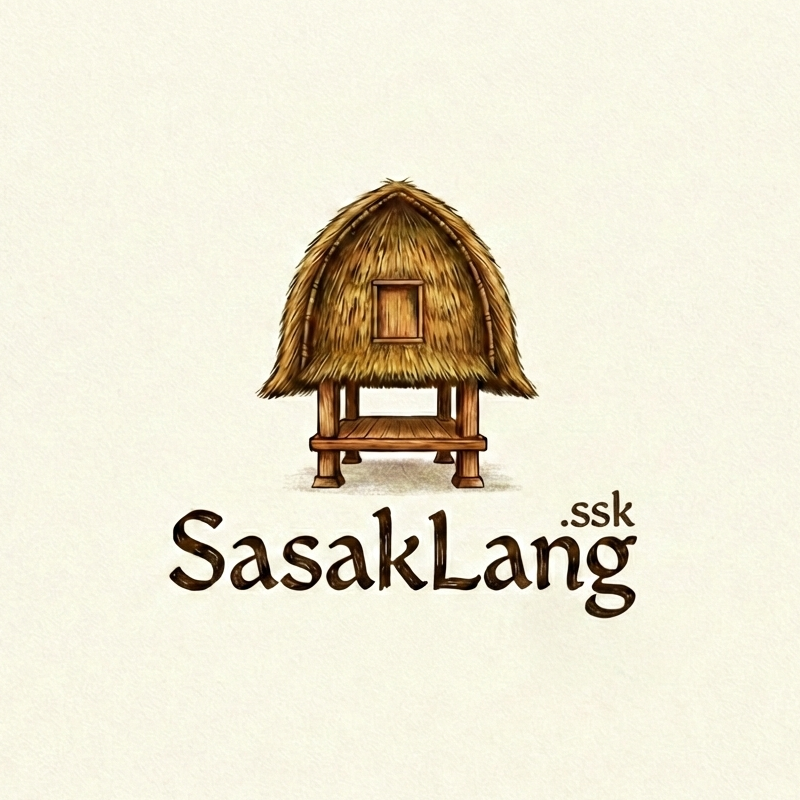

<h1 align="center">SasakLang</h1>

<p align="center">
  
</p>

<p align="center">
  <strong>Bahasa Pemrograman Berbasis Bahasa Sasak (Lombok)</strong>
</p>

SasakLang adalah bahasa pemrograman esoterik yang menggunakan kosa kata Bahasa Sasak.

## Fitur
- **Keyword Sasak**: `gawe`, `lamun`, `selame`, `fungsi`, dll.
- **Syntax Highlighting**.
- **Snippets**.

## Contoh
```sasak
cetak("Halo Dunia!")
```
